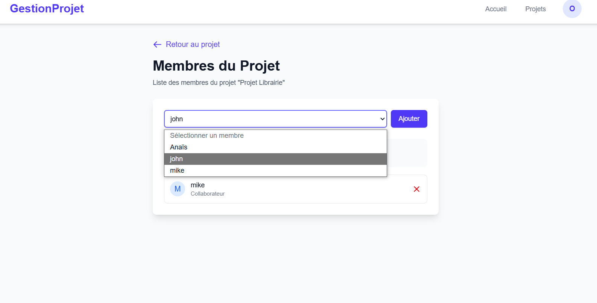
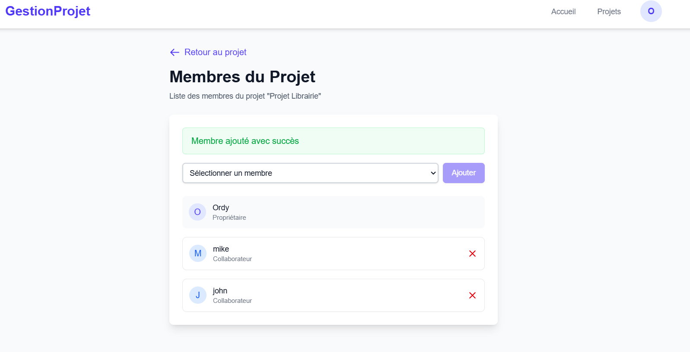

# GestionProjet - Application de Gestion de Projets

Une application web moderne de gestion de projets construite avec Next.js et Back4App.


## 🚀 Fonctionnalités

- 🔐 Authentification utilisateur (inscription/connexion)
- 📋 Création et gestion de projets
- 📅 Suivi des dates limites
- 🎯 Gestion des statuts de projet
- 💻 Interface utilisateur moderne et responsive

## 🛠️ Technologies Utilisées

- **Frontend**:
  - Next.js 14
  - React
  - TypeScript
  - Tailwind CSS

- **Backend**:
  - Back4App (Parse Server)

## 📋 Prérequis

- Node.js (version 18 ou supérieure)
- npm ou yarn
- Compte Back4App

## 🔧 Installation

1. **Cloner le dépôt**
   ```bash
   git clone https://github.com/votre-username/gestion-projet.git
   cd gestion-projet
   ```

2. **Installer les dépendances**
   ```bash
   npm install
   # ou
   yarn install
   ```

3. **Configuration de Back4App**

   a. Créez un compte sur [Back4App](https://www.back4app.com/)
   
   b. Créez une nouvelle application dans votre dashboard Back4App
   
   c. Dans les paramètres de votre application, récupérez les informations suivantes :
      - Application ID
      - JavaScript Key
      - Server URL

4. **Configuration de l'environnement**

   Créez un fichier `.env.local` à la racine du projet avec les variables suivantes :
   ```env
   NEXT_PUBLIC_PARSE_APPLICATION_ID=votre_app_id_back4app
   NEXT_PUBLIC_PARSE_JAVASCRIPT_KEY=votre_javascript_key_back4app
   NEXT_PUBLIC_PARSE_SERVER_URL=https://parseapi.back4app.com
   ```

5. **Configuration de Parse**

   Le fichier `src/lib/parse.ts` initialise Parse avec les variables d'environnement :
   ```typescript
   import Parse from 'parse';

   Parse.initialize(
     process.env.NEXT_PUBLIC_PARSE_APPLICATION_ID || '',
     process.env.NEXT_PUBLIC_PARSE_JAVASCRIPT_KEY || ''
   );

   Parse.serverURL = process.env.NEXT_PUBLIC_PARSE_SERVER_URL || 'https://parseapi.back4app.com';

   export default Parse;
   ```

6. **Démarrer l'application**
   ```bash
   npm run dev
   # ou
   yarn dev
   ```

   L'application sera accessible à l'adresse : `http://localhost:3000`

## 📁 Structure du Projet

```
gestion-projet/
├── src/
│   ├── app/                    # Pages et routes Next.js
│   ├── components/             # Composants React réutilisables
│   ├── hooks/                  # Hooks personnalisés
│   ├── lib/                    # Configuration et utilitaires
│   │   └── parse.ts           # Configuration de Parse
│   └── models/                 # Modèles Parse
├── public/                     # Fichiers statiques
└── package.json               # Dépendances et scripts
```


## 🚀 Déploiement

1. **Préparation**
   ```bash
   npm run build
   # ou
   yarn build
   ```

2. **Démarrage en Production**
   ```bash
   npm start
   # ou
   yarn start
   ```

## 🔍 Tests

```bash
npm test
# ou
yarn test
```


# Documentation des Relations et Pointeurs utilisés

## Structure des Données

### Projet (Project)
- **Propriétaire (owner)**
  - Type : Pointeur vers `_User`
  - Description : L'utilisateur qui a créé le projet
  - Accès : Lecture/Écriture pour le propriétaire, Lecture pour les membres

- **Membres de l'équipe (teamMembers)**
  - Type : Relation avec `_User`
  - Description : Liste des utilisateurs collaborant sur le projet
  - Accès : 
    - Lecture : Tous les membres du projet
    - Écriture : Uniquement le propriétaire (ajout/suppression de membres)

### Utilisateur (_User)
- **Projets créés**
  - Type : Relation inverse avec `Project`
  - Description : Liste des projets dont l'utilisateur est propriétaire
  - Accès : Lecture/Écriture pour l'utilisateur concerné

- **Projets en collaboration**
  - Type : Relation inverse avec `Project`
  - Description : Liste des projets où l'utilisateur est membre
  - Accès : Lecture pour l'utilisateur concerné

## Permissions

### Projet
- **Propriétaire**
  - Peut modifier tous les champs du projet
  - Peut ajouter/supprimer des membres
  - Peut supprimer le projet

- **Membre**
  - Peut voir les détails du projet
  - Peut voir la liste des membres
  - Ne peut pas modifier le projet
  - Ne peut pas gérer les membres

### Utilisateur
- **Profil personnel**
  - Peut voir ses projets (créés et en collaboration) 


  
  